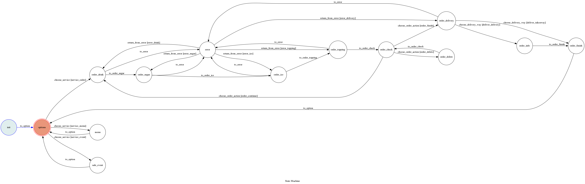

# Ordering Machine Chatbot

This is an ordering machine messenger chat bot template, which suitable for beverage shop.

## Setup

### Prerequisite
* Python 3
* Facebook Page and App
* HTTPS Server
* Database server (using MySQL in this project)

#### Install Dependency

* Dependency
	* `pip3 install -r requirements.txt`
* pygraphviz (For visualizing Finite State Machine)
    * [Setup pygraphviz on Ubuntu](http://www.jianshu.com/p/a3da7ecc5303)

#### Secret Data

* Run `cp config.py.default config.py`
* Fill in secret data such like `VERIFY_TOKEN`, `ACCESS_TOKEN`, `DATABASE_PASSWORD`, ...etc in `config.py`

#### Setup host

* You can either setup https server or using `ngrok` as a proxy
* Run `./ngrok http 5000` in where `ngrok` exists
* After that, `ngrok` would generate a https URL. Use this url as host
* Everytime `ngrok` restart, the url will change

#### Run the sever

```sh
python3 app.py
```

## Finite State Machine


## Usage

* Push "Start" button to start a chat thread
* Choose a service from below
	* Make an order
	* Request for menu
	* Ask if any promotion
* If choose to make an order
	* Choose one drink at once
	* Choose sweetness level
	* Choose ice level
	* Choose topping
	* Check order, could choose action below
		* continue ordering another drink
		* delete order
		* finish order
	* Choose how to get the drinks (take-away or delivery)
		* if choose delivery, need to provide costumer information
	* Finish order, send any message for another service
* If choose to request for menu, will get an url to official website
* If choose to ask if any promotion, will get a promotion message and a post image

## Reference

* [TOC-Project-2017](https://github.com/Lee-W/TOC-Project-2017)
* [@Lee-W](https://github.com/Lee-W)
* [Facebook_API_Document](https://developers.facebook.com/docs/messenger-platform/)
* [pytransitions/transitions](https://github.com/pytransitions/transitions)
* [SQLAlchemy](https://www.sqlalchemy.org/)
